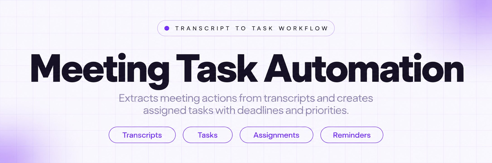
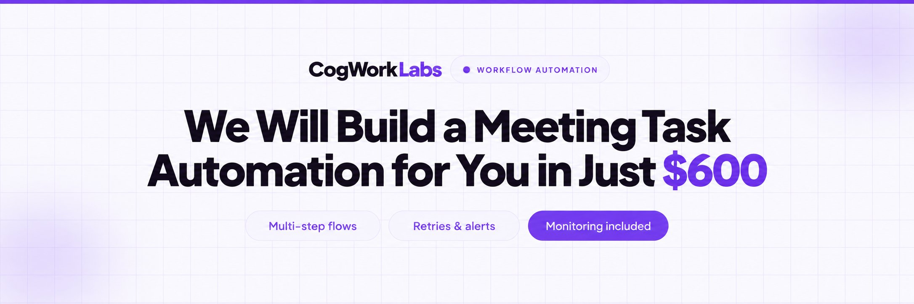
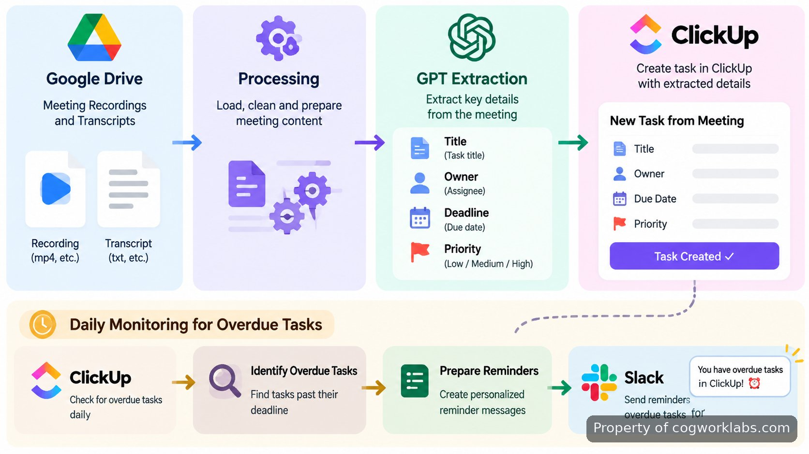
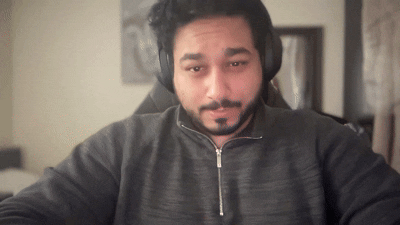

<p align="center">
  <a href="https://www.cogworklabs.com" target="_blank" rel="nofollow">
    
  </a>
</p>

## ClickUp Automations

ClickUp Automations is a meeting-to-task workflow that turns Google Meet recordings and transcripts into structured ClickUp work items. The tool watches a Google Drive folder for new meeting files, sends transcript content through a GPT processing step, extracts action items with titles, owners, deadlines, and priorities, then creates tasks after matching each owner to the correct ClickUp user ID.

The workflow is designed for teams that lose decisions between meetings and task systems. Instead of manually copying notes, identifying responsibilities, and assigning follow-ups, the process converts the meeting record into task data that can be reviewed inside ClickUp. A daily monitoring process also checks task status, identifies overdue items, and sends Slack reminders or escalations when follow-up is required.

> Meeting conversations become structured tasks with ownership, deadlines, and follow-up tracking.

<a href="https://www.cogworklabs.com" target="_blank" rel="nofollow">
  
</a>

<p align="center">
  <a href="https://t.me/Bitbash333" target="_blank" rel="nofollow">
    
  </a>&nbsp;
  <a href="https://wa.me/923249868488?text=Hi%2C%20I%27m%20interested." target="_blank" rel="nofollow">
    
  </a>&nbsp;
  <a href="mailto:hello@cogworklabs.com" target="_blank" rel="nofollow">
    
  </a>&nbsp;
  <a href="https://www.cogworklabs.com" target="_blank" rel="nofollow">
    
  </a>
</p>

## Automation Architecture

The workflow uses a sequence of connected services rather than a single action. New Google Meet recordings and transcripts enter through a monitored Google Drive location. The processing layer reads the transcript, identifies task-worthy statements, and formats each item into fields that ClickUp can accept. The final stage creates tasks and keeps a separate monitoring cycle active for overdue work.



The main flow can be represented as four operational stages:

1. Google Drive receives a new recording or transcript.
2. GPT processing extracts structured action items from the text.
3. Owner mapping connects names to ClickUp user IDs before task creation.
4. Monitoring checks overdue tasks and sends Slack notifications.

Google Drive is used as the source location because the workflow depends on recorded meeting artifacts. The integration follows the storage model described in the <a href="https://developers.google.com/drive/api/guides/about-sdk" target="_blank" rel="nofollow">Google Drive API documentation</a>, while ClickUp task creation follows the structures available through the <a href="https://developer.clickup.com/" target="_blank" rel="nofollow">ClickUp API documentation</a>.

## Core Features

| Feature | Description |
| --- | --- |
| Transcript Detection | Missing meeting follow-up starts with finding new recordings and transcripts. The workflow monitors the configured Google Drive location and picks up new files for processing. |
| GPT Action Items | Unstructured meeting notes often leave responsibilities unclear. The extraction layer converts transcript text into structured action items containing title, owner, deadline, and priority fields. |
| ClickUp Task Mapping | Manual assignment creates delays when names do not match workspace users. The mapping step connects each extracted owner to a ClickUp user ID before creating the task. |
| Automated Task Creation | Copying decisions from meetings into project boards creates repetitive work. The workflow creates ClickUp tasks from approved structured data with the required assignment details. |
| Slack Reminders | Overdue tasks can disappear after creation. The daily monitoring process checks task status and sends Slack reminders or escalations for unfinished work. |

## GPT Action Items and Data Handling

The extraction stage focuses on turning conversational language into fields that another system can use. A transcript sentence such as "Maria will prepare the launch checklist by Friday with high priority" becomes a structured record containing an action title, assigned person, deadline, and priority value.

The workflow does not require meeting participants to write tasks manually during the call. Instead, it processes the available transcript after the meeting and separates decisions from general conversation. The GPT connection follows the patterns described in the <a href="https://platform.openai.com/docs/api-reference" target="_blank" rel="nofollow">OpenAI API documentation</a> for sending structured requests and receiving generated responses.

Structured extraction reduces a common failure point in project tracking: the meeting happened, but nobody converted the outcome into a visible task. The resulting task record keeps the original responsibility model intact by preserving who owns the next action and when it is expected.

## ClickUp Task Automation Workflow

The task creation stage sits between extracted information and the project workspace. Before a task is created, the owner field is matched against available workspace users. This prevents assignments from being created with only text names that cannot connect to an actual account.

A typical run starts with a transcript containing several follow-ups. The workflow separates each action item, assigns the correct owner ID, adds deadline and priority values, and creates individual tasks rather than placing all meeting notes into one large description.

This approach supports ClickUp task automation where the important part is not only creating a task, but creating a task with enough context to continue the work after the meeting ends.

<a href="https://tally.so/r/b5QYLL?platform=GitHub&amp;format=Product+repo&amp;brand=CogWorkLabs&amp;niche=automation&amp;page=ClickUp+Automations+for+ClickUp+Tasks&amp;date=2026-09-07" target="_blank" rel="nofollow">
  
</a>

## Google Drive Monitoring

Finding new meeting records is the first trigger in the workflow. The monitored folder acts as the entry point for recordings and transcripts generated from meetings. Each new file starts a processing path instead of requiring someone to remember a manual export step.

The monitoring layer relies on file events and scheduled checks rather than scanning unrelated storage locations. This keeps the workflow focused on the meeting archive that contains the records needed for task extraction.

The Google Meet source fits into this design because recordings and transcripts already exist as digital artifacts. The workflow works with those artifacts after they appear in storage, following the account and permission patterns described in the <a href="https://developers.google.com/workspace" target="_blank" rel="nofollow">Google Workspace developer documentation</a>.

## Slack Reminders

Creating tasks solves only part of the tracking problem. The monitoring cycle checks for overdue items and communicates status changes through Slack when deadlines pass without completion.

The notification path uses Slack messages as the escalation channel. The connection follows the methods described in the <a href="https://api.slack.com/docs" target="_blank" rel="nofollow">Slack API documentation</a> for sending application-generated messages to workspace channels or recipients.

A daily check creates a clear separation between task creation and task follow-up. The first process captures responsibilities from meetings, while the second process watches whether those responsibilities remain open after their expected completion date.

## Use Cases

- Project managers can convert recurring meeting discussions into assigned ClickUp tasks without manually reviewing every transcript after a call.
- Operations teams can track commitments from internal meetings by extracting owners, deadlines, and priority levels into a shared task workspace.
- Remote teams can maintain follow-up visibility by combining meeting transcripts, task creation, and Slack reminders in one workflow.

## Project Directory

```text
clickup-meeting-task-system/
├── src/
│   ├── drive_monitor.py
│   ├── transcript_parser.py
│   ├── task_mapper.py
│   ├── clickup_client.py
│   └── slack_notifier.py
├── config/
│   └── settings.yaml
├── logs/
│   └── workflow.log
├── requirements.txt
└── README.md
```

## Workflow Automation Setup

The finished workflow is configured around connected accounts, monitored locations, and task destinations. A typical setup requires access to the Google Drive source folder, ClickUp workspace permissions, GPT processing credentials, and Slack notification permissions.

- **STEP 1 — Download & Set Up the Project** Download, set up, and install **ClickUp Automations** to get the project running from the delivered repository package.
- **STEP 2 — Connect Sources** Open the workflow configuration and connect the Google Drive folder, ClickUp workspace, and Slack destination used by the process.
- **STEP 3 — Configure Inputs** Select transcript processing settings and provide the meeting files, owner mappings, and task fields used during extraction.
- **STEP 4 — Run Processing** Trigger the workflow run, create ClickUp tasks from extracted records, and receive Slack reminders for overdue items.

## Technical Stack

The implementation combines APIs and automation components that match each stage of the workflow. Google Drive handles source files, GPT handles transcript extraction, ClickUp stores generated tasks, and Slack provides notification delivery.

| Component | Role |
| --- | --- |
| Google Drive API | Provides access to meeting recordings and transcript files. |
| OpenAI API | Processes transcript text into structured action item data. |
| ClickUp API | Creates tasks and assigns mapped workspace users. |
| Slack API | Delivers reminders and escalation messages. |

The repository documents the approach, workflow structure, and system behavior behind this automation. The production version is maintained separately with deployment and operational support.

## FAQ

### How does the workflow turn meeting transcripts into ClickUp tasks?

The workflow reads meeting transcript content, extracts action items with title, owner, deadline, and priority fields, maps owners to ClickUp user IDs, and creates tasks with the resulting data.

### Can the workflow send reminders for overdue tasks?

Yes. A daily monitoring process checks task status and sends Slack reminders or escalations when tracked tasks become overdue.

### What information is needed before running the system?

The workflow requires access to the meeting file location, ClickUp workspace permissions, GPT processing access, and Slack notification permissions so each stage can communicate with the next.

<table>
  <tr>
    <td align="center" width="33%">
      
      <p>This scraper helped me gather thousands of posts effortlessly. The setup was fast, and exports are super clean and well-structured.</p>
      <p><b>Nathan Pennington</b><br>Marketer<br>★★★★★</p>
    </td>
    <td align="center" width="33%">
      
      <p>What impressed me most was how accurate the extracted data is. Likes, comments, timestamps — everything aligns perfectly.</p>
      <p><b>Greg Jeffries</b><br>SEO Affiliate Expert<br>★★★★★</p>
    </td>
    <td align="center" width="33%">
      
      <p>It's by far the best tool I've used. Ideal for trend tracking, competitor monitoring, and influencer insights.</p>
      <p><b>Karan</b><br>Digital Strategist<br>★★★★★</p>
    </td>
  </tr>
</table>